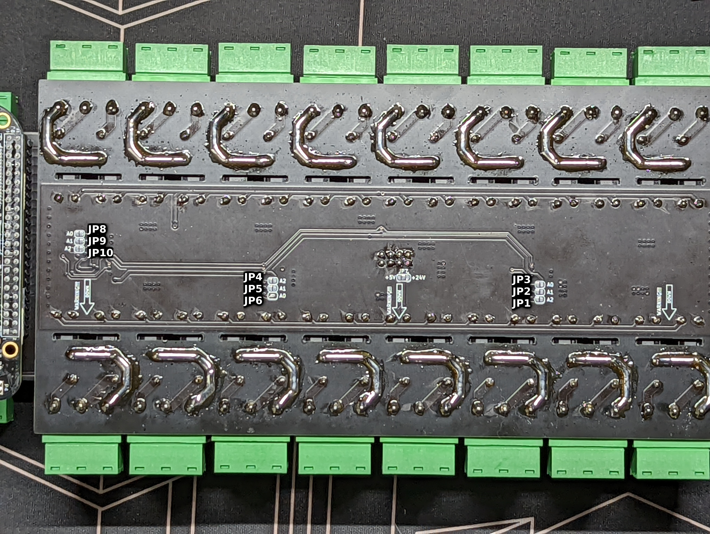
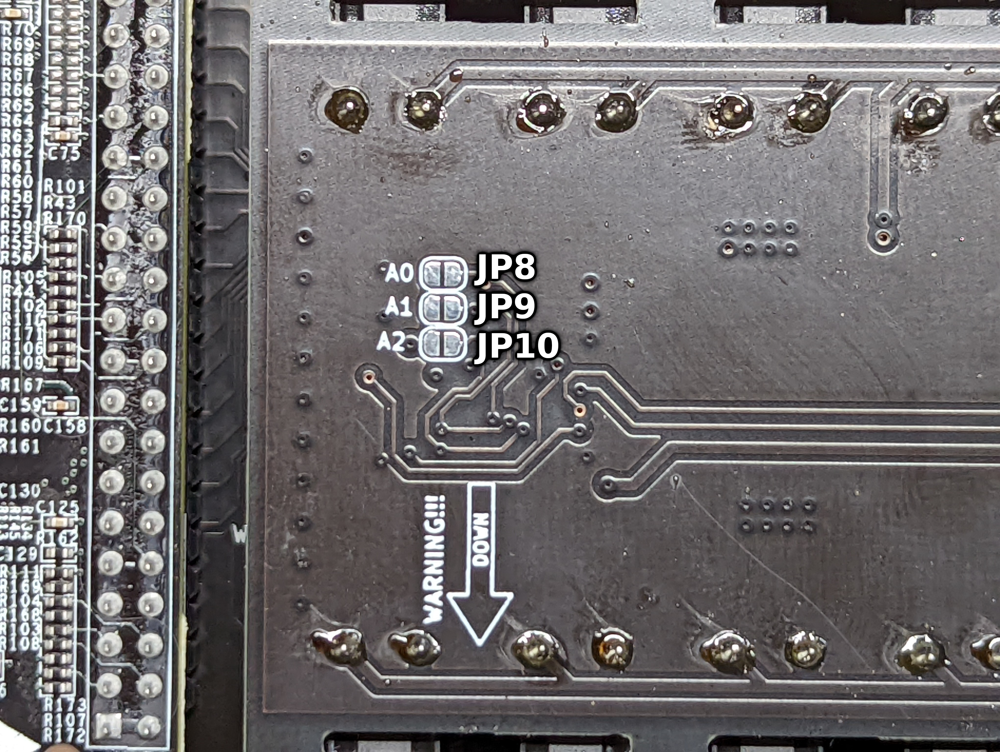
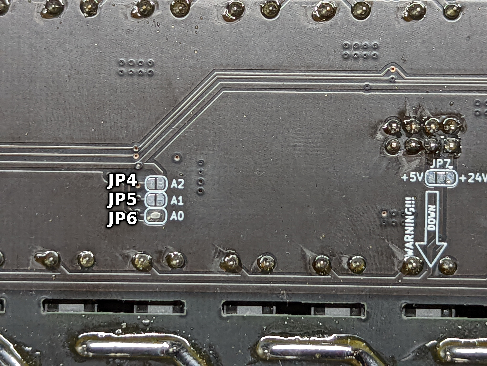
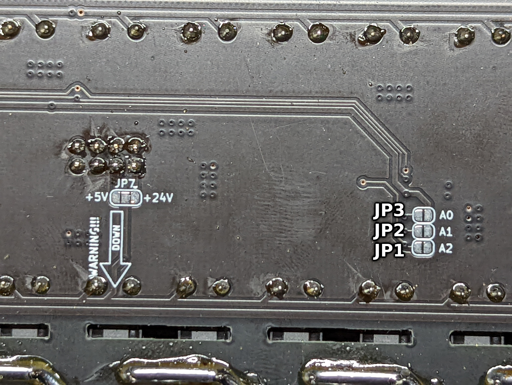

# Output Boards

## Relay Board 24x16A

Comming soon

### Bill of Materials

Here you will find complete BOM soon ;)

### How to assemble the board

Comming soon!

## Relay Board 32x5A

Comming soon

### Bill of Materials

Here you will find complete BOM soon ;)

### How to assemble the board

Comming soon!

### Board I2C configuration

Temperature sensor MCP9808

| Chip Address    | A2 (JP10)   | A1 (JP9)    | A0 (JP8)    | I2C Address    | Alternative I2C Address    |
|-----|-----|-----|-----|-----|-----|
| 000    |     |     |     | 0x48    | 0x18    |
| 001    |     |     | Soldered    | 0x49    | 0x19    |
| 010    |     | Soldered    |     | 0x4A    | 0x1A    |
| 011    |     | Soldered    | Soldered    | 0x4B    | 0x1B    |
| 100    | Soldered    |     |     | 0x4C    | 0x1C    |
| 101    | Soldered    |     | Soldered    | 0x4D    | 0x1D    |
| 110    | Soldered    | Soldered    |     | 0x4E    | 0x1E    |
| 111    | Soldered    | Soldered    | Soldered    | 0x4F    | 0x1F    |

Relay Outputs MCP23017

| Chip Address    | A2   | A1    | A0    | I2C Address    |
|-----|-----|-----|-----|-----|
| 000    |     |     |     | 0x20    |
| 001    |     |     | Soldered    | 0x21    |
| 010    |     | Soldered    |     | 0x22    |
| 011    |     | Soldered    | Soldered    | 0x23    |
| 100    | Soldered    |     |     | 0x24    |
| 101    | Soldered    |     | Soldered    | 0x25    |
| 110    | Soldered    | Soldered    |     | 0x26    |
| 111    | Soldered    | Soldered    | Soldered    | 0x27    |

Relays 9-16; 25-32

| MCP Address PIN    | Board PIN    |
|-----|-----|
| A0    | JP6   |
| A1    | JP5   |
| A2    | JP4   |

Relays 1-8; 17-24

| MCP Address PIN    | Board PIN    |
|-----|-----|
| A0    | JP1   |
| A1    | JP2   |
| A2    | JP3   |

